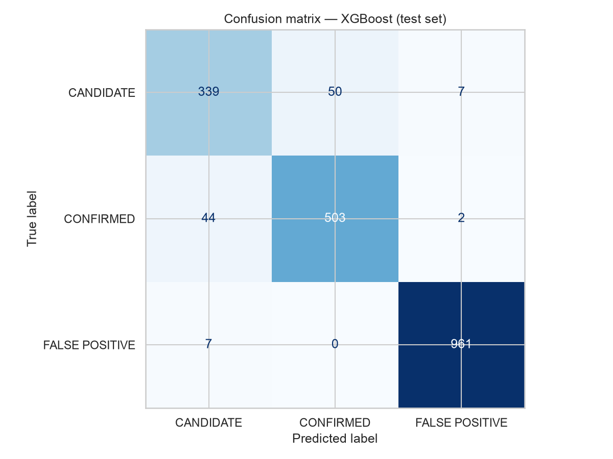
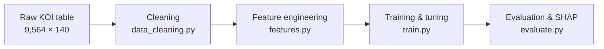

# Exoplanet classification: Kepler Objects of Interest

A machine learning pipeline that classifies Kepler Objects of Interest (KOIs) from the NASA Exoplanet Archive cumulative table into three categories: CONFIRMED exoplanets, CANDIDATEs, and FALSE POSITIVEs. The project covers exploratory analysis, domain-driven feature engineering, model comparison, and SHAP-based explainability.

## Results

XGBoost is the final model, evaluated on a held-out stratified test set.

| Metric | Score |
|---|---|
| Accuracy | 0.942 |
| Macro F1 | 0.922 |
| F1, FALSE POSITIVE | 0.992 |
| F1, CONFIRMED | 0.913 |
| F1, CANDIDATE | 0.863 |

FALSE POSITIVEs are almost perfectly separable. Most remaining errors are CANDIDATE vs CONFIRMED confusion, which is expected: a candidate is by definition an object that has not yet been ruled in or out, so the two classes overlap physically.



## Pipeline



Cleaning drops unusable and leaky columns, encodes categoricals, and imputes with medians fit on the training split. Feature engineering adds 8 domain-derived features and prunes redundant ones. Three models are compared (logistic regression, random forest, XGBoost) with cross-validated tuning, and the winner is evaluated with an ablation study and SHAP.

## Project structure

```
data/raw/                 KOI cumulative table (9,564 × 140)
data/processed/           intermediate artifacts, if generated
notebooks/
  01_eda.ipynb            EDA: missingness, class balance, distributions,
                          correlation structure, leakage audit
  02_modeling.ipynb       preprocessing, feature engineering, models,
                          tuning, evaluation, ablation, SHAP
src/
  data_cleaning.py        load/validate, drop unusable & leaky columns,
                          encode, impute, stratified split
  features.py             8 domain-derived features + redundancy pruning
  train.py                LogReg / Random Forest / XGBoost, CV, tuning
  evaluate.py             metrics, confusion matrix, ROC, importances, SHAP
reports/writeup.md        narrative summary of approach and findings
reports/writeup.pdf       PDF export of the writeup
figures/                  all saved plots
requirements.txt
```

## Setup

Requires Python 3.11+.

```bash
python -m venv .venv
source .venv/bin/activate
pip install -r requirements.txt
```

On macOS, XGBoost needs the OpenMP runtime. Run `brew install libomp` first.

## Run

Execute the notebooks in order. Each runs top to bottom with no external state:

```bash
jupyter nbconvert --to notebook --execute --inplace notebooks/01_eda.ipynb
jupyter nbconvert --to notebook --execute --inplace notebooks/02_modeling.ipynb
```

Or open them interactively with `jupyter lab`. The modeling notebook takes about 6 minutes, most of it spent in the randomized hyperparameter search.

## Key decisions

- **Macro F1 is the primary metric.** The classes are imbalanced (51/29/21%), so accuracy would flatter majority-class predictions.
- **Leakage is controlled explicitly.** `koi_score` is absent by design and not reconstructed. `koi_pdisposition` and `kepler_name` are excluded because their missingness encodes the label. Imputation medians are fit on the training split only.
- **Class weighting instead of resampling.** Weighting keeps every real observation and avoids synthesizing physically impossible objects in a heavy-tailed feature space.
- **Kepler's `koi_fpflag_*` columns are explicitly excluded** as data leakage — they are the output of NASA's vetting pipeline and encode the target classification.

Full rationale and a plain-language interpretation of the model are in [reports/writeup.md](reports/writeup.md).

## Data

`data/raw/KOI_Cumulative_clean.csv` is the NASA Exoplanet Archive Kepler cumulative KOI table (9,564 rows, 140 columns; `koi_score` removed at source).
